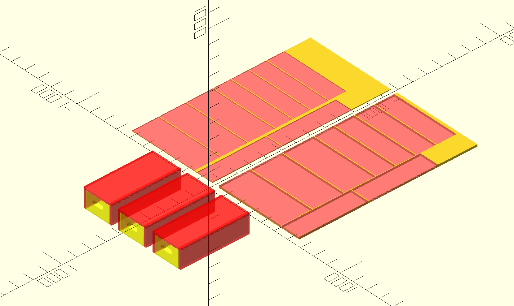

# Keyboard Shelf

This is a shelf to put on top of an existing deep shelf. It contains a drawer
that fits a configurable number of gridfinity baseplates inside. The goal was to
elevate the back part of an existing shelf to display my keyboards more densely,
while not wasting the space beneath it. The file also shows how to cut the
requisite pieces out of a sheet of stock. Parameters at the top of the file are
customizable.
